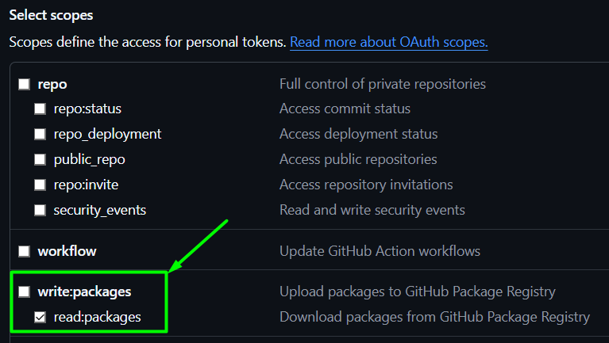

# Java telegram easy bot
# 📚 tg-lib

## INFO
___
Библиотека для создания ботов в телеграм.

Позволяет быстро запустить бота с возможностью:
- обработки команд
- обработки текстовых сообщений
- создания форм

### Подключение библиотеки
[Здесь](#2-подключение-библиотеки)

### 📝 Пример формы

> Каждая форма привязана к своему сообщению  
> И хранит контекст

[Код формы](./example-echo-bot/src/main/java/com/vk/dwzkf/tglib/example/echobot/commands/SimpleFormHandler.java)

### 📝 Пример обработки текста


[Код обработки](./example-echo-bot/src/main/java/com/vk/dwzkf/tglib/example/echobot/text/EchoTextMessageHandler.java)


<br>

## ⚡️ Quick start
___
### Настройка
#### Настройка репозитория [GitHub Packages](https://docs.github.com/en/packages/learn-github-packages/introduction-to-github-packages)
##### 1. Настройка **github**
> Создать AccessToken (если токен есть этот шаг можно пропустить)
1. Перейти в [настройку токенов](https://github.com/settings/tokens)
2. Создать токен с правами **read:packages**

3. Скопировать токен
4. Открыть файл `%userprofile%/.gradle/gradle.properties` (Windows)
5. Создать в нем следующие проперти:
```properties
gpr.user=<логин github>
gpr.key=<ключ из шага 3>
```

##### 2. Настройка репозиториев
-  в **build.gradle** добавить **GitHub Packages** репозиторий:
```groovy
ext {
    gitRepostioryName = 'java-telegram-easy-bot'
}

repositories {
    maven {
        url = uri("https://maven.pkg.github.com/fkzwd/$gitRepostioryName")
        credentials {
            username = project.findProperty("gpr.user") ?: System.getenv("USERNAME")
            password = project.findProperty("gpr.key") ?: System.getenv("TOKEN")
        }
    }
} 
```
*Теперь gradle сможет подтянуть зависимость*
___
### Создание бота
#### 1. Создаем проект
1. Создать `springboot` проект
2. Подключаем зависимость
```groovy
depdendencies {
    implementation 'org.springframework.boot:spring-boot-starter'
}
```
#### 2. Подключение библиотеки
`build.gradle`:
```groovy
ext {
    tglibBotCoreVersion = '1.0.0'
}
dependencies {
    implementation "com.vk.dwzkf.tglib:bot-core:$tglibBotCoreVersion"
}
```
#### 3. Настройка проперти
```yaml
bot:
  bot-name: "my_custom_bot" # имя бота при создании
  token: "mybotapikey" # токен полученный от https://t.me/BotFather
  secure: false # бот будет отвечать всем
```
*По умолчанию `bot.secure=true`; бот игнорирует сообщения от всех*

#### 4. Включение бинов бота в контекст приложения
```java
import com.vk.dwzkf.tglib.botcore.BotCore;
//...
@SpringBootApplication(scanBasePackageClasses = {Main.class, BotCore.class})
public class Main {
    public static void main(String[] args) {
        SpringApplication.run(Main.class, args);
    }
}
```
#### 4. Фильтр авторизации
> TODO
#### 5. Создание простого обработчика команды
1. Создаем компонент спринга
2. Вешаем на него аннотацию `@RouteCommand(command = "your_command")`
3. Создаем метод который на вход принимает `MessageContext`
```java
@RouteCommand(command = "annotation")
@Component
public class AnnotationCommandHandler {
    @RouteCommandHandler
    public void handle(MessageContext ctx) throws BotCoreException {
        ctx.doAnswer("[ANNOTATED]: "+ctx.getRawData());
    }
}
```

___
#### 6. Создание обработчика текста
1. Создаем компонент имплементирующий интерфейс `TextMessageHandler<T extends MessageContext>`
> Здесь используется `extends DefaultTextMessageHandler` - он работает с `MessageContext`
```java
@Service
@TextHandler
@Order(1)
public class EchoTextMessageHandler extends DefaultTextMessageHandler  {
    @Override
    public boolean match(MessageContext messageContext) {
        return true;
    }
    @Override
    public void handle(MessageContext messageContext) throws BotCoreException {
        messageContext.doAnswer("[ECHO]: "+messageContext.getMessage());
    }
}
```

#### 7. Отправка формы с кнопками
- Создаем форму, которая выводит текущее время и может обновляться

`CurrentTimeForm.java`:
```java
public class CurrentTimeForm extends Form {
    public static final DateTimeFormatter DATE_TIME_FORMAT = DateTimeFormatter.ofPattern("yyyy-MM-dd HH:mm:ss");
    
    public CurrentTimeForm() {
        setTitle("<b>Заголовок формы</b>");
        setTextProvider(() ->
                "<b>Текущее время:</b> <code>%s</code>"
                        .formatted(LocalDateTime.now().format(DATE_TIME_FORMAT))
        );
        addRow().addButton(new RefreshButton(this));
        createControls(false,true); //создаем кнопку закрытия формы
    }
}
```  

`OneButtonFormhandler.java` - обработчик команды `/time`:
```java
@Component
@RouteCommand(command = "time")
public class OneButtonFormHandler extends FormSender<MessageContext> implements CommandHandler<MessageContext> {

    public static final DateTimeFormatter DATE_TIME_FORMAT = DateTimeFormatter.ofPattern("yyyy-MM-dd HH:mm:ss");

    @Override
    public void handle(MessageContext messageContext) throws BotCoreException {
        Form form = new CurrentTimeForm();
        sendForm(form, messageContext);
    }

    @Override
    public Class<MessageContext> supports() {
        return MessageContext.class;
    }
}
```

#### 8. Пользовательский контекст
*TODO: доделать*  
> По умолчанию все обработчики на вход принимают `MessageContext`  
> Это можно изменить создав свою реализацию `factory`
- Пользовательский контекст:
```java
@Getter
@Setter
public class CustomContext extends MessageContext {
    private String uuid = UUID.randomUUID().toString();
}
```
- Пользовательская `factory`:
```java
@Component
public class CustomContextFactory implements MessageContextFactory<CustomContext> {
    @Override
    public CustomContext create() {
        return new CustomContext();
    }
}
```
- Обработчик команд принимающий `CustomContext`
```java
@RouteCommand(command = "custom")
@Component
public class CustomContextHandler {
    @RouteCommandHandler
    public void handle(CustomContext context) throws BotCoreException {
        context.doAnswer(
                "[<code>%s</code>]\ncommand: <b>%s</b>\nargs: <b>%s</b>".formatted(
                        context.getUuid(),
                        context.getCommandContext().getCommand(),
                        context.getCommandContext().getRawArgs()
                ));
    }
}
```
*Результат:*  

#### 42. Заполнение пользовательского контекста
> TODO: ...
___
## TODO
1. Поддержка различных `ActionType`
2. Добавить `UnauthorizedHandler`
3. Обработка когда форма обновляется точно такой же `[400] Bad Request: message is not modified`